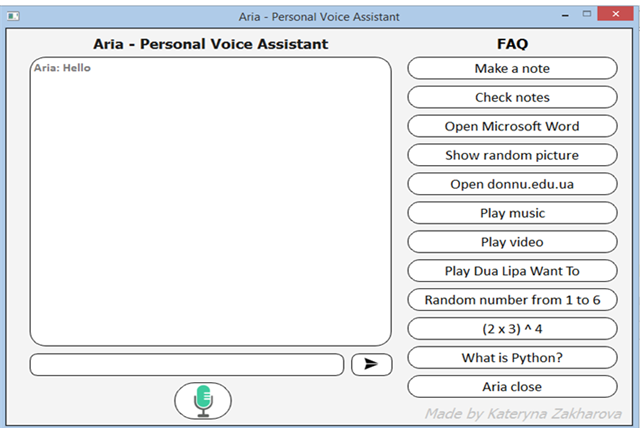

# Aria - Personal Voice Assistant

:exclamation: Do your tasks **faster** with this app. Dictate notes, open programs, play music and so on **with just your voice**!
There is also manual control presents. Click the buttons or write your message in the text line.

### :sparkle: Interface of the App

### :sparkle: Architecture

  Two classes are used to describe the architecture of the program:
  * The first class is responsible for the correct choice of a particular block of code, depending on the user's request;
  * The second is responsible for receiving the user's voice commands, processing information, converting audio data into text, transmitting text information to the first class and converting the result of the command received from the first class into audio format.
  
  There is the third class. It responsible for the user's communication with the app - UI.

### :sparkle: Structure of the Project

  There are two files:
  * **Aria.py** contains the main functional;
  * **mainwindow.py** implements UI.

:heavy_check_mark: I mastered:
* Python
* PyQt5
* Parsing
